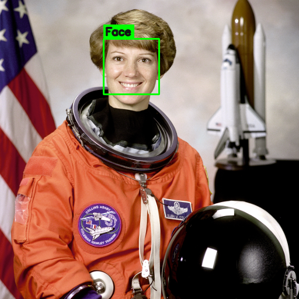

# Emotion Detection

Real-time **face detection + emotion recognition** in Python. It finds faces
in a webcam feed (or an image) with OpenCV, then classifies each face into one
of seven emotions — **Angry, Disgust, Fear, Happy, Sad, Surprise, Neutral** —
using a small CNN trained on the FER-2013 dataset.

This mirrors the standard OpenCV + Keras emotion-detection approach: a Haar
cascade locates faces, and a "mini-Xception" network reads the expression.



*(Face detection running on a sample photo. With the emotion model downloaded,
the label reads e.g. `Happy 92%` instead of `Face`.)*

## How it works

```
webcam / image ──► OpenCV Haar cascade ──► crop each face ──► CNN ──► emotion
                     (face detection)                      (FER-2013 model)
```

- **Face detection** — `haarcascade_frontalface_default.xml`, which ships with
  OpenCV. Fast, CPU-only, no GPU required.
- **Emotion classification** — a mini-Xception CNN (~0.66 validation accuracy
  on FER-2013). Each detected face is converted to grayscale, resized to the
  model's input, and passed through the network to get per-emotion scores.

The two stages live in [`src/emotion_detector.py`](src/emotion_detector.py) and
are independent, so you can swap either one out.

## Setup

Requires Python 3.9+.

```bash
cd emotion-detection
pip install -r requirements.txt      # OpenCV, NumPy, TensorFlow

# Download the pretrained emotion model (~880 KB) into models/
python download_model.py
```

> If you only want face detection (no emotion labels), you can skip TensorFlow
> and the model download, and run with `--no-emotion`.

## Usage

### Real-time webcam

```bash
python -m src.realtime               # default webcam
python -m src.realtime --mirror      # selfie / mirrored view
python -m src.realtime --camera 1    # a different camera
python -m src.realtime --no-emotion  # face boxes only, no model needed
```

Controls: **`q`** or **`Esc`** to quit, **`s`** to save a screenshot.

### A single image

```bash
python -m src.detect_image samples/astronaut.png
python -m src.detect_image photo.jpg --output annotated.jpg --no-show
```

It prints each face's top emotion plus a bar chart of all seven scores, and
writes an annotated copy of the image.

### From your own code

```python
import cv2
from src.emotion_detector import EmotionDetector

detector = EmotionDetector()          # loads face cascade + emotion model
frame = cv2.imread("photo.jpg")

for det in detector.analyze(frame):
    print(det.box, det.emotion, det.confidence)
    print(det.scores)                 # {'Happy': 0.92, 'Neutral': 0.05, ...}
```

## Project layout

```
emotion-detection/
├── requirements.txt
├── download_model.py          # fetch the pretrained FER-2013 model
├── models/                    # model weights land here (git-ignored)
├── samples/                   # example images
└── src/
    ├── emotion_detector.py    # core: face detection + emotion classification
    ├── realtime.py            # webcam real-time detection
    ├── detect_image.py        # run on a single image file
    └── train.py               # (optional) train the model on FER-2013
```

## Training your own model (optional)

Most people should just use `download_model.py`. To retrain from scratch,
grab `fer2013.csv` from the
[FER-2013 Kaggle challenge](https://www.kaggle.com/datasets/msambare/fer2013)
and run:

```bash
python -m src.train --data path/to/fer2013.csv --epochs 100
```

## Notes & limitations

- Haar cascades detect **frontal** faces best; extreme angles or heavy
  occlusion may be missed. For tougher conditions, swap in OpenCV's DNN face
  detector or `FaceDetectorYN`.
- FER-2013 is trained on posed, mostly Western faces at low resolution, so
  predictions are an **approximation of expression**, not a measurement of
  someone's actual internal emotional state. Treat outputs accordingly,
  especially in any wellbeing or clinical context.
- Runs on CPU. A webcam is required for real-time mode.

## Credits

- Face detection: [OpenCV](https://opencv.org/) Haar cascades.
- Emotion model architecture & pretrained weights: the mini-Xception model from
  [oarriaga/face_classification](https://github.com/oarriaga/face_classification),
  trained on FER-2013.
