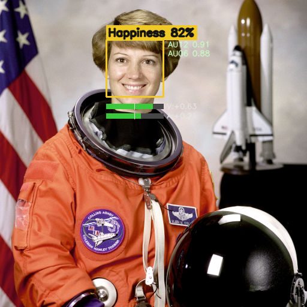

# Emotion Detection

Face detection + **granular emotion recognition** in Python. Beyond sorting a
face into one of seven fixed buckets, it can report **continuous valence &
arousal** and **FACS Action Units** (individual facial-muscle movements) — a
much finer-grained read on expression.

It ships three interchangeable backends behind one interface, so you pick the
tradeoff you want:

| Backend | What it reports | Speed | Best for |
|---|---|---|---|
| **`hsemotion`** | 8 emotions **+ valence & arousal** (continuous) | Fast | Real-time webcam |
| **`pyfeat`** | **20 FACS Action Units** + 7 emotions + valence/arousal | Slow | Deep image / video analysis |
| **`fer`** | 7 emotions only (original mini-Xception) | Fast | Lightweight / baseline |



*Overlay: top emotion + confidence, active Action Units (right), and valence/
arousal meters (below). Numbers in this still are illustrative placeholders
showing the layout — real values come from the model at runtime.*

## Why more than 7 categories?

Discrete labels force every expression into one box and throw away intensity
and nuance. Two complementary upgrades fix that:

- **Dimensional affect — valence & arousal.** Two continuous axes: valence
  (negative ↔ positive) and arousal (calm ↔ excited). Captures "mildly
  content" vs. "elated," or "tense" vs. "furious." → `hsemotion`.
- **Facial Action Units (FACS).** Decomposes an expression into ~20
  individual muscle activations (e.g. **AU06** cheek raiser + **AU12**
  lip-corner puller = a genuine "Duchenne" smile). The interpretable standard
  used in affective-science research. → `pyfeat`.

> Note: "Phase-Retention Emotion Recognition" isn't an established technique —
> if that term brought you here, the real, current methods for granular
> emotion capture are the two above, both implemented here.

## Setup

Requires Python 3.9+ (3.11+ for the `pyfeat` backend).

```bash
cd emotion-detection
pip install -r requirements.txt            # core: OpenCV + NumPy

# then install ONLY the backend(s) you want:
pip install -r requirements-hsemotion.txt  # fast real-time (valence/arousal)
pip install -r requirements-pyfeat.txt     # deep analysis (Action Units)
pip install -r requirements-fer.txt        # legacy FER-2013; also:
python download_model.py                   #   (fer only) fetch model weights
```

`hsemotion` and `pyfeat` download their model weights automatically on first
run.

## Usage

### Real-time webcam

```bash
python -m src.realtime                    # hsemotion (default, recommended)
python -m src.realtime --mirror           # selfie view
python -m src.realtime --backend fer      # legacy 7-emotion model
```

Controls: **`q`**/**`Esc`** quit, **`s`** screenshot. (Py-Feat runs several
models per face, so it's only a few FPS live — use it for images/video below.)

### Deep image / video analysis

```bash
# Single image — Action Units + emotions + valence/arousal, printed + CSV
python -m src.analyze photo.jpg
python -m src.analyze photo.jpg --csv results.csv --output annotated.jpg

# Faster, dimensional read on an image
python -m src.analyze photo.jpg --backend hsemotion

# Video — Py-Feat writes a per-frame CSV you can plot/aggregate
python -m src.analyze clip.mp4 --csv clip.csv --skip-frames 5
```

The image mode prints each face's top emotion, a bar chart of all emotion
scores, valence/arousal, and every active Action Unit, then saves an annotated
image (and a CSV with `--csv`).

### From your own code

```python
import cv2
from src.backends import get_backend

backend = get_backend("hsemotion")        # or "pyfeat", "fer"
frame = cv2.imread("photo.jpg")

for face in backend.analyze(frame):
    print(face.summary())                 # "Happiness  val=+0.63  aro=+0.21  AUs[AU06,AU12]"
    print(face.emotion, face.emotion_scores)
    print(face.valence, face.arousal)     # None if the backend doesn't provide them
    print(face.action_units)              # {} unless using pyfeat
```

Every backend returns the same `FaceResult`; fields a backend can't produce
are `None`/empty, so your code stays uniform.

## Project layout

```
emotion-detection/
├── requirements*.txt          # core + one file per backend
├── download_model.py          # fetch the legacy FER-2013 weights
├── models/                    # FER weights land here (git-ignored)
├── samples/                   # example images
└── src/
    ├── backends/
    │   ├── base.py            # EmotionBackend interface + FaceResult
    │   ├── face_detection.py  # shared OpenCV Haar detector
    │   ├── hsemotion_backend.py
    │   ├── pyfeat_backend.py
    │   └── fer_backend.py
    ├── visualize.py           # draw boxes, emotion, VA meters, Action Units
    ├── realtime.py            # webcam CLI
    ├── analyze.py             # image / video CLI with CSV export
    ├── emotion_detector.py    # legacy FER engine (used by the fer backend)
    └── train.py               # (optional) train the FER model on FER-2013
```

## Emotions, dimensions & Action Units

- **hsemotion** emotions: Anger, Contempt, Disgust, Fear, Happiness, Neutral,
  Sadness, Surprise. Valence & arousal ≈ [-1, 1].
- **pyfeat** emotions: anger, disgust, fear, happiness, sadness, surprise,
  neutral. Action Units are FACS codes (AU01 inner-brow raiser … AU45 blink);
  values are activation intensities. Valence/arousal come from Py-Feat's v2
  multitask model.

## Notes & limitations

- **Expression ≠ inner state.** These models estimate *facial expression*, not
  what a person actually feels. Posed vs. genuine affect, cultural display
  rules, and context all matter. In any wellbeing or clinical setting, treat
  outputs as a signal to interpret, not a measurement of emotion.
- Accuracy varies with lighting, pose, occlusion, and demographics (training
  data skews toward posed, Western faces). Action Units are more robust and
  interpretable than a single categorical guess.
- `hsemotion` and `pyfeat` need to download model weights on first run.

## Credits

- Face detection: [OpenCV](https://opencv.org/) Haar cascades.
- `hsemotion`: [EmotiEffLib / HSEmotion](https://github.com/sb-ai-lab/EmotiEffLib)
  (Savchenko), EfficientNet trained on AffectNet.
- `pyfeat`: [Py-Feat](https://github.com/cosanlab/py-feat) — Python Facial
  Expression Analysis Toolbox.
- `fer`: mini-Xception from
  [oarriaga/face_classification](https://github.com/oarriaga/face_classification),
  trained on FER-2013.
